# AP-2 → AP-3 Process Flow

Flow นี้แสดงกระบวนการตั้งแต่ขอเบิกเงินทดรอง AP-2 จนถึงเคลียร์เงินทดรอง AP-3 ตาม implementation ปัจจุบัน

```mermaid
flowchart TD
    Start([เริ่มต้น]) --> A1[ผู้ขอสร้างฟอร์ม AP-2]
    A1 --> A2[บันทึก Draft]
    A2 --> A3{ข้อมูลครบหรือไม่}

    A3 -- ไม่ครบ --> A2
    A3 -- ครบ --> A4[Submit AP-2]
    A4 --> A5[ระบบเลือก Approval Flow ตามวงเงิน]
    A5 --> A6[Head Accounting]

    A6 --> A7{อนุมัติหรือไม่}
    A7 -- ส่งกลับ --> A2
    A7 -- ไม่อนุมัติ --> Reject2[AP-2 Rejected]
    A7 -- อนุมัติ --> A8{ต้องผ่าน Director หรือไม่}

    A8 -- ใช่ --> A9[Director]
    A9 --> A10{อนุมัติหรือไม่}
    A10 -- ส่งกลับ --> A2
    A10 -- ไม่อนุมัติ --> Reject2
    A10 -- อนุมัติ --> A11[Accounting Officer]

    A8 -- ไม่ใช่ --> A11
    A11 --> A12[กำหนด Payment Date]
    A12 --> A13{อนุมัติหรือไม่}
    A13 -- ส่งกลับ --> A2
    A13 -- ไม่อนุมัติ --> Reject2
    A13 -- อนุมัติ --> A14[AP-2 Approved]

    A14 --> A15[Preview Journal]
    A15 --> A16{ข้อมูลบัญชีถูกต้องหรือไม่}
    A16 -- ไม่ถูกต้อง --> A17[แก้ G/L Bank Batch หรือ Dimension]
    A17 --> A15
    A16 -- ถูกต้อง --> A18[ส่ง Journal เข้า Business Central]
    A18 --> A19{ส่งสำเร็จหรือไม่}
    A19 -- ไม่แน่ชัดหรือ Timeout --> A20[ตรวจ BC และ Reconcile ก่อน Retry]
    A20 --> A19
    A19 -- สำเร็จ --> Paid[จ่ายเงินทดรอง]

    Paid --> C1[ผู้ขอสร้างฟอร์ม AP-3]
    C1 --> C2[เลือก AP-2 ที่อนุมัติแล้ว]
    C2 --> C3[บันทึกค่าใช้จ่าย VAT และ WHT]
    C3 --> C4{เปรียบเทียบกับเงินทดรอง}

    C4 -- เงินเหลือ --> C5[โอนคืนบริษัทและแนบสลิป]
    C4 -- ยอดพอดี --> C6[ไม่คืนและไม่จ่ายเพิ่ม]
    C4 -- ค่าใช้จ่ายเกิน --> C7[บริษัทต้องจ่ายเพิ่ม]

    C5 --> C8[แนบใบเสร็จหรือใบกำกับภาษี]
    C6 --> C8
    C7 --> C8

    C8 --> C9[Submit AP-3]
    C9 --> C10[Manager]
    C10 --> C11{อนุมัติหรือไม่}

    C11 -- ส่งกลับ --> C3
    C11 -- ไม่อนุมัติ --> Reject3[AP-3 Rejected]
    C11 -- อนุมัติ --> C12[Account Office]

    C12 --> C13[ตรวจเอกสาร PV และ Payment Date]
    C13 --> C14{อนุมัติหรือไม่}
    C14 -- ส่งกลับ --> C3
    C14 -- ไม่อนุมัติ --> Reject3
    C14 -- อนุมัติ --> C15[Head Accounting]

    C15 --> C16{อนุมัติหรือไม่}
    C16 -- ส่งกลับ --> C3
    C16 -- ไม่อนุมัติ --> Reject3
    C16 -- อนุมัติ --> C17[AP-3 Approved]

    C17 --> Manual[Manual Journal และ Reconciliation]
    Manual --> End([จบกระบวนการ])
```

## หมายเหตุ

- AP-2 ใช้ approval matrix ตามช่วงวงเงิน ลำดับจริงต้องอ้างอิง configuration
- AP-2 ERP send กับการอัปเดตสถานะ Portal ไม่ใช่ transaction เดียว หาก timeout ต้องตรวจ BC ก่อน retry
- AP-3 ใช้ลำดับ `Manager → Account Office → Head Accounting`
- AP-3 Phase ปัจจุบันยังไม่มี ERP auto-post ขั้นสุดท้ายจึงเป็น manual journal และ reconciliation
- Return จะส่งคำขอกลับให้ผู้ขอแก้ไขและ Submit ใหม่ ส่วน Reject เป็นการยุติคำขอ
